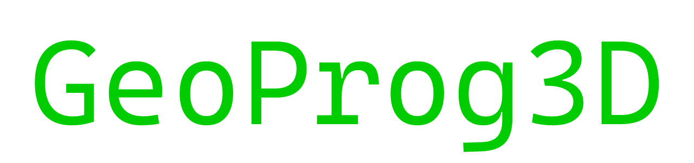
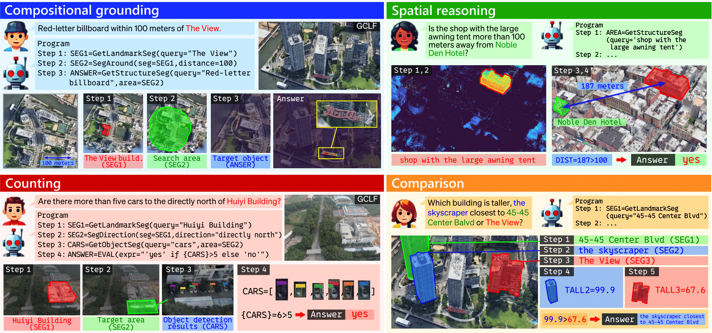
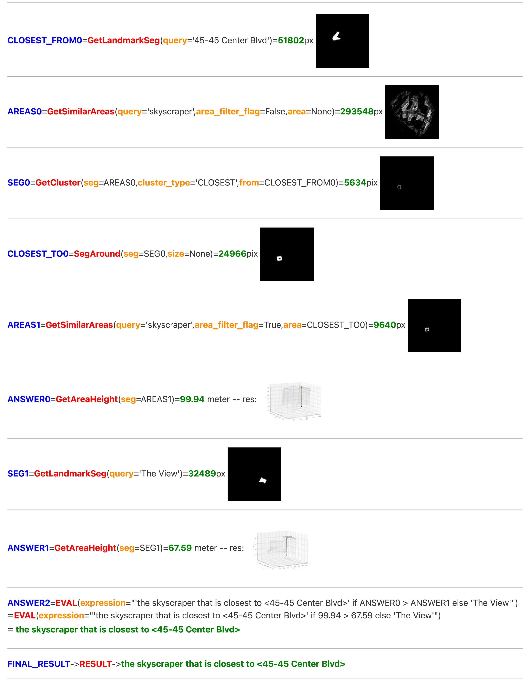
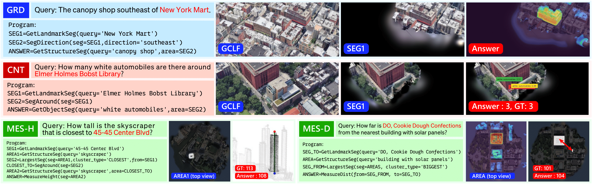
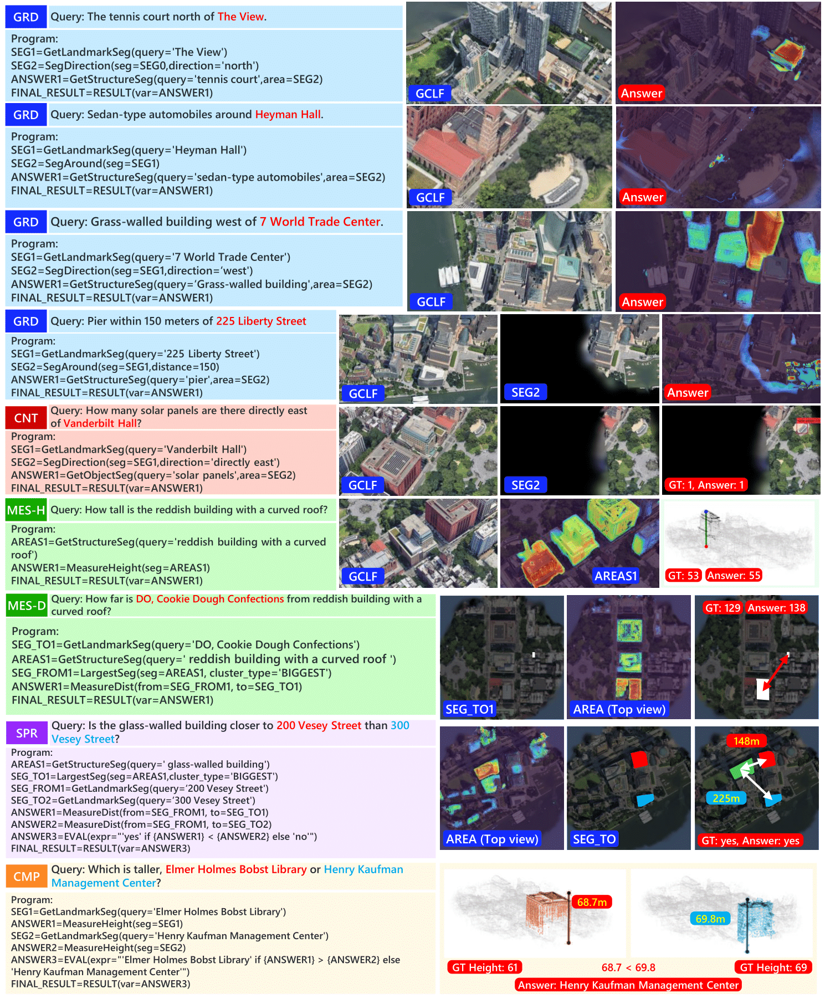

# [ICCV 2025] 🌍 GeoProg3D: Compositional Visual Reasoning for City-Scale 3D Language Fields 

<!-- <div align="center">
  <a href="">
    
  </a>
</div>
--- -->

<div align="center">
  <a href="">
    
  </a>
</div>

<!--  -->
<br>


## 🏙️ GeoProg3D Framework

This repository contains the official implementation of the paper _"GeoProg3D: Compositional Visual Reasoning for City-Scale 3D Language Fields"_. 

- 📂 `geoprog3d`: This directory contains the main implementation of the Geographical Vision APIs (GV-APIs).

- 📂 `LoG`: This directory contains the code for 3D Gaussians.

- 📂 `LangSplat`: This directory contains the code for querying the 3D language field using open vocabulary queries.


### ⚙️ Installation


1. Follow the following steps to set up the environment.  You also need to install [LangSplat](https://github.com/minghanqin/LangSplat), [LoG](https://github.com/zju3dv/LoG) and [GroundingDINO](https://github.com/IDEA-Research/GroundingDINO).

  ```shell
cd ./geoprog3d/
conda env create -f environment.yaml
source activate geoprog3d
conda install notebook ipykernel
ipython kernel install --user --name geoprog3d
```


2. Place pre-trained weights in the following locations:

  ```shell
  output/model_tree.pth
  output/model_tree_colors.pth
  ckpts/best_ckpt.pth
  GroundingDINO_SwinT_OGC.py
  groundingdino_swint_ogc.pth
```

3. Set your API key to `OPENAI_API_KEY` in `geoprog3d/engine/utils.py` to specify the LLM for generating programs. The default model is `gpt-3.5-turbo-instruct`. Currently, only model types belonging to `openai.ChatCompletion` are supported.

### 🌐 Demonstration

We provide a notebook [geoprog3d/notebooks/main.ipynb](geoprog3d/notebooks/main.ipynb) for executing the grounding (GRD), counting (CNT), spatial reasoning (SPR), measuring (MES), and comparing (CMP) tasks. To load queries for different scenes, you need to modify the `dataset_name` and `scene_name` variables. Note that the weight files are specified in `geoprog3d/config/config.yml` and `geoprog3d/config/<dataset>/<scene>.yml`.

<div align="center">
  <a href="">
    
  </a>
</div>


## 🌇 GeoEval3D Dataset

Complete data will be available from an external link.

### 🔍 Annotation data


| Scene | LangSplat | LangSplat (w/ tree) | Ours | Links |
| --- | --- | --- | --- | --- |
| Center-Blvd (GoogleEarth_1) | 7.69 | 19.23 | 42.31 |  |
| WorldFinancialCtr (GoogleEarth_2) | 20 | 16 | 44 |  |
| Mott St (GoogleEarth_3) | 10.71 | 17.86 | 53.57 |  |
| WashingtonSquare(GoogleEarth_4) | 18.18 | 27.27 | 40.91 |  |
| Campus (UrbanScene3D) | - | 6.98 | 30.23 |  |

### 🗺️ Georeference data

Georeferencing results for each scene are provided under the `georeference` directory.

## Qualitative Results

<!-- <div align="center">
  <a href="">
    
  </a>
</div> -->

<div align="center">
  <a href="">
    
  </a>
</div>


## License

- Codebase: [MIT](LICENSE)
- GeoEval3D Dataset: [CC-BY-4.0](https://creativecommons.org/licenses/by/4.0/legalcode)

## Acknowledgements

We would like to express our gratitude to the authors of the following codebase.

- [LangSplat](https://github.com/minghanqin/LangSplat)
- [VisProg](https://github.com/allenai/visprog)
- [Level of Gaussians](https://github.com/zju3dv/LoG)
- [GroundingDINO](https://github.com/IDEA-Research/GroundingDINO)


## Citation

If you found our paper or code useful, please cite it as:

```
@inproceedings{
  yasuki2025geoprog3d,
  title={GeoProg3D: Compositional Visual Reasoning for City-Scale 3D Language Fields},
  author={Shunsuke, Yasuki and Taiki, Miyanishi and Nakamasa, Inoue and Shuhei, Kurita and Koya, Sakamoto and Daichi, Azuma and Masato, Taki and Yutaka Matsuo},
  booktitle={Proceedings of the IEEE/CVF International Conference on Computer Vision (ICCV)},
  year={2025},
  <!-- url={https://arxiv.org/abs/} -->
}
```
